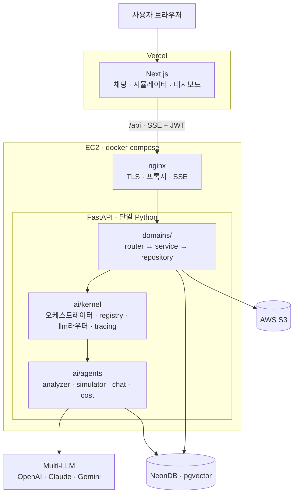
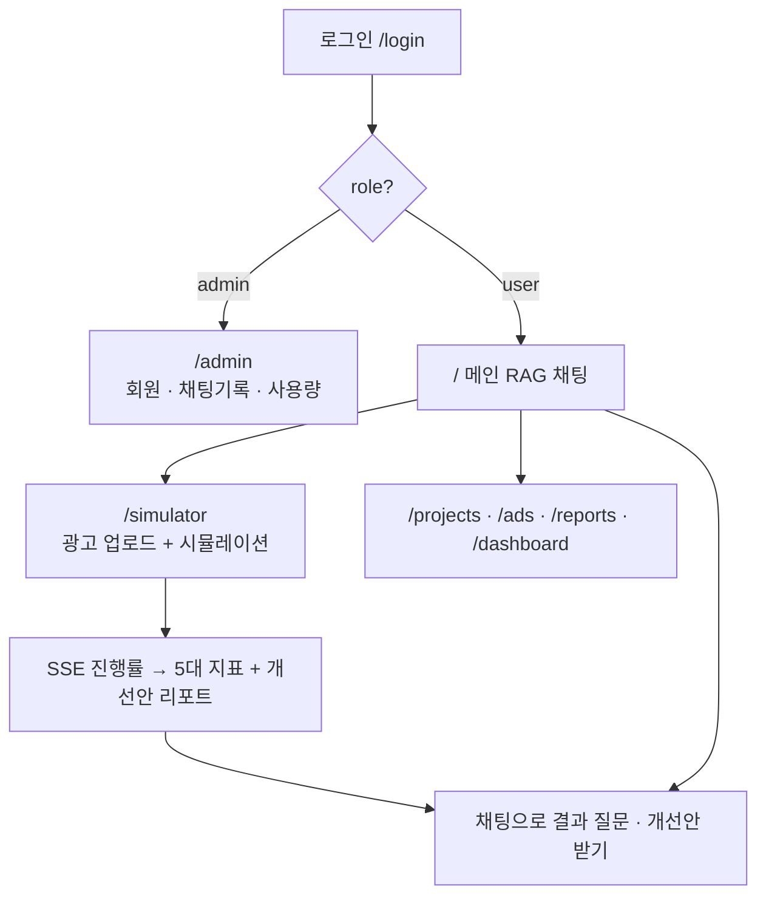
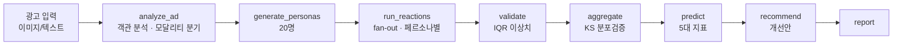
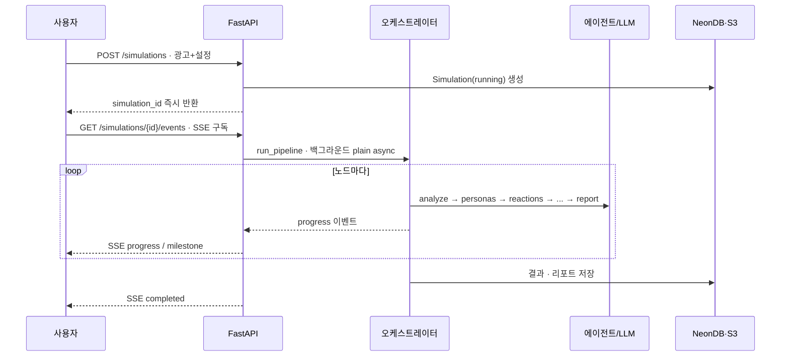

# Click Me — AI 광고 성과 시뮬레이터

> 광고를 실제 집행하기 **전에**, AI로 생성한 다양한 가상 소비자(Persona)에게 먼저 테스트해
> 성과를 예측하는 플랫폼. "사람과 똑같은 응답"이 아니라 **"직감보다 나은 데이터 근거"** 를 제공한다.

📖 **전체 설계·결정·근거는 [`llms.txt`](./llms.txt) (단일 SSOT)** 를 보세요. 이 README는 팀 온보딩·작업 시작용 요약입니다.

> 현재 상태: **Track 0 진행 중** — `shared`·auth·DB·Alembic 골격 완료, **실제 Neon에서 로그인 E2E 검증됨**(health·login·me·refresh·에러봉투). 다음: 나머지 도메인/모델(14테이블).

---

## 한눈에

| 항목 | 내용 |
|---|---|
| 팀 | Click Studio (6명) · 팀장 정요한 |
| 일정 | 베이스라인 **6/12** · 최종 7/8 · 발표 7/14 |
| 작업 방식 | 백엔드/AI 다같이 협업 · 프론트는 별도 담당자 |

**핵심 흐름**
```
광고 → 객관 분석(모달리티 분기) → 페르소나 생성 → 페르소나별 주관 반응
     → 집계 → 5대 지표 → 개선안     (텍스트=텍스트 LLM / 이미지=VLM)
```

---

## 기술 스택

- **Frontend**: Next.js (React) · Zustand · TanStack Query
- **Backend**: FastAPI · Uvicorn · Pydantic · SQLAlchemy(Async) · Alembic
- **AI**: LangChain · LangGraph · LangSmith · Multi-LLM(OpenAI·Claude·Gemini)
- **Data**: NeonDB(PostgreSQL) · pgvector · AWS S3
- **Infra**: Docker · uv · GitHub Actions · (EC2 + nginx)
- 선택: AWS SQS · Cloudflare

---

## 아키텍처 요약

**모듈러 모놀리스** (단일 Python) · AI 엔진=**허브-스포크** · 경계=**헥사고날(라이트)**



### 디렉터리
```
backend/app/
  shared/     공통 플랫폼 (config·db·security·deps·events·logging)
  domains/    웹: router → service → repository  (auth·projects·ads·simulations·chat·admin…)
  ai/
    kernel/   허브: orchestrator·registry·llm라우터·cost·tracing
    agents/   스포크: analyzer · simulator · chat · cost(P2)
contracts/    ★ SSOT — Pydantic→JSON/TS (프론트·백 유일 결합점)
frontend/     Next.js (별도 담당자)
infra/        nginx (EC2 배포용)
```

- **단방향 의존**: `router→service→repository→DB`, `service→ai.kernel.registry→agents/*`. 에이전트끼리 직접 호출 ❌(오케스트레이터 중재).
- **에이전트 4(레지스트리) / 3(제품 노출)**: 광고분석·시뮬레이터·채팅·비용(P2).

---

## 유저 플로우



---

## 서비스 흐름 — 광고 시뮬레이션

**파이프라인** (= 오케스트레이터 노드 = 추적 단위)



**실행·SSE 흐름** (요청 → 백그라운드 → 실시간 스트리밍)



> 대전제: **분석=객관(감정 X) / 반응=주관(페르소나별)**. 텍스트→텍스트 LLM, 이미지→VLM.

---

## 빠른 시작

**사전 요구**: `uv`(Python 3.12), Docker, Node 18+/`pnpm`

```bash
# 백엔드
cd backend
uv sync                                   # 의존성 (팀원은 이거면 끝)
cp .env.example .env                       # DATABASE_URL(Neon) · JWT_SECRET 등 채우기
uv run alembic upgrade head                # 마이그레이션 (auth 테이블 생성)
uv run python -m scripts.seed              # 샘플 seed (admin@clickme.io / ChangeMe123!)
uv run uvicorn app.main:app --reload       # http://localhost:8000/api/health

# 프론트 (별도 담당자)
cd frontend
pnpm install
pnpm dev                                   # http://localhost:3000  (/api → :8000 rewrites)

# (선택) prod-like 통합 확인
docker compose up --build                  # nginx + backend
```

**환경변수 규칙** (자세히는 llms.txt)
- `backend/.env` = **시크릿** (DB·JWT·LLM키). EC2에선 AWS는 IAM 롤 → 키 불필요.
- `frontend/.env` = `NEXT_PUBLIC_*` **공개값만** (번들 노출 — 시크릿 절대 금지).
- 프론트가 키가 필요하면 → **백엔드가 대신 호출**(프록시).

---

## 작업 순서 (팀 합의: Track 0 → B → C → A)

> **계약 우선**: 무엇이든 `contracts/`에 스키마부터 → 그다음 구현. 트랙 간 결합은 contracts·registry·SSE로만.

| 트랙 | 내용 | DoD |
|---|---|---|
| **0. 토대** ⛔선행 | shared · DB(17)+Alembic+seed · contracts 뼈대(응답봉투+error-code+JWT클레임) · auth | `/api/auth/login` + 보호 라우트 + 마이그레이션 |
| **B. AI 엔진** (다같이·핵심) | kernel · analyzer(이미지 VLM 우선) · simulator(persona→reaction→…→report) · SSE progress | POST 시뮬 → SSE 진행률 → 20명 + 5지표 + report |
| **C. 채팅** | domains/chat · agents/chat(tools·RAG-lite·토큰 SSE) | 세션→메시지→SSE + 시뮬 결과 참조 |
| **A. 웹 CRUD** (마지막) | projects·ads(S3)·reports·dashboard·admin… | 엔드포인트 + 권한 + 테스트 |

- **B는 mock LLM + 이미지 fixture로 개발** (실모델은 Phase 0 bake-off 후, Track A 없이 seed로).
- **전체 DoD**: 로그인 → 광고 업로드 → 시뮬(SSE) → 5지표 리포트 → 채팅 + 관리자 + 다크모드.

---

## 꼭 지킬 규칙

- **계약 우선 · 직접 import 금지** (트랙 간) → 6명 병렬 충돌 0
- **시크릿은 backend만**, 평문 기밀 로그 금지 (예산·크리에이티브)
- **uvicorn `--workers 1`** (SSE 인메모리 버스와 정합 — 늘리지 말 것)
- **베이스라인 입력 = 이미지(핵심)+텍스트**. 영상·URL은 P2.
- 브랜치: `main` 보호 + PR 리뷰 필수

---

## 배포 (개요)

```
FE  app.* → Vercel (Next.js)
BE  api.* → EC2 + docker-compose(nginx + uvicorn) · IAM 롤로 S3 접근
DB  NeonDB · S3 (외부)
CI/CD  GitHub Actions (개인 레포 테스트 → 팀은 Variables만 교체)
```

---

## ⚠️ 팀이 다같이 정해야 할 것 (LLM·개인 단정 금지)

- **핵심 지표 5종 / segment enum** — DB 스키마 직결, 팀 논의로 확정
- 그 외 미결: llms.txt "열린 질문" 참고 (Likert 전환 · emotion 필드 · 데모 광고 등)

---

📂 **더 깊이**: 데이터 모델(17테이블)·신뢰도 검증(SSR)·트레이싱·SSE/SQS·전체 결정 근거 → **[`llms.txt`](./llms.txt)**
